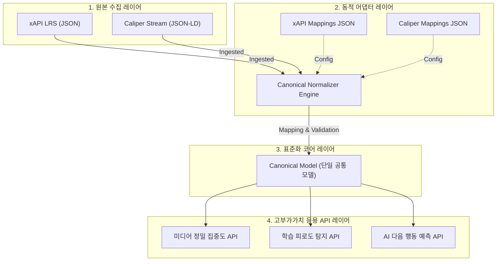

# 🧬 xAPI Extensions 기반 API 개발 로드맵 및 1EdTech 표준 연계 분석 보고서

본 분석 보고서는 LRS의 실서비스 데이터가 보유한 **`extensions` 메타데이터의 의미론적(Semantic) 가치를 극대화**하고, 단순 통계 조회를 넘어 **AI 학습 진단 모델 적용**에 이르는 API 라인업 로드맵을 제시합니다. 아울러, 글로벌 에듀테크 상호운용성 표준인 **1EdTech 규격(LTI, Caliper, OneRoster)**과의 전략적 연계성을 분석하여, 우리가 구축한 **Canonical Data Model 기반 어댑터 아키텍처**가 지닌 원천적 우수성을 기술적으로 검증합니다.

---

## 1. 🔍 핵심 전제: xAPI `extensions`의 데이터 가치
xAPI 표준 규격의 핵심 파워는 단순한 행위(Verb)의 기록에 있지 않고, `context.extensions` 혹은 `result.extensions` 내부의 **정밀한 컨텍스트 메타데이터**에 있습니다. 

현재 우리가 마주하고 있는 실시간 데이터 모델은 다음과 같은 핵심 확장 필드를 이미 안정적으로 주입받고 있습니다:
*   **Media Profile**: `play-speed` (배속), `volume` (볼륨), `play-time` (현재 정밀 재생 지점)
*   **Assessment Profile**: `score` (점수), `duration` (풀이 소요 시간)
*   **Navigation Profile**: `target-page` (목적지), `time-spent` (체류 시간)

이 정보들은 학생의 **집중도 흐름, 학습 피로도(Frustration), 인지적 과부하 상태(Cognitive Overload)**를 정량화할 수 있는 강력한 원천 리소스가 됩니다.

---

## 2. 🚀 xAPI Extensions 기반 API 개발 로드맵 (난이도별 리스트업)

### 2.1 🟢 [난이도: 하] 정밀 데이터 트래킹 및 통계 시각화 API
데이터 가공 및 집계 수준에서 extensions 값을 활용해 즉각적인 비즈니스 가치를 내는 정량 지표들입니다.

#### ① 미디어 정밀 집중도 핫스팟(Heatmap) 분석 API
*   **Verb / Extensions**: `played` (play-time) + `paused` (play-time) + `seeked` (extensions.play-time & target-time)
*   **동작 아키텍처**: 
    *   동일 미디어 컨텐츠 내에서 다수 유저들의 `paused`가 집중적으로 발생하는 구간, 혹은 `seeked`를 통해 역방향(Rewind)으로 되돌아가 다시 시청하는 구간을 5초 단위 윈도우로 카운팅합니다.
*   **산출 지표**: 미디어 콘텐츠 ID별 **"인지적 걸림돌 구간(Cognitive Bottleneck Zones)"** 좌표 목록 제공.

#### ② 평가 소요 시간 대비 정답률(풀이 효율성) 계수 API
*   **Verb / Extensions**: `submitted` (result.extensions.score, context.extensions.duration)
*   **동작 아키텍처**:
    *   문항의 난이도 기준 평균 소요 시간과 비교하여, 학생이 문항당 소요한 실제 `duration`의 편차를 계산합니다.
    *   $\text{풀이 효율성} = \frac{\text{획득 점수(score)}}{\text{실제 풀이 소요 시간(duration)}}$
*   **산출 지표**: 찍어서 맞춘 학생(극도로 짧은 시간 + 고득점)과 깊이 고민했으나 실패한 학생(긴 시간 + 오답)을 분류해주는 **"학습 몰입 효율 지수"** 도출.

---

### 2.2 🟡 [난이도: 중] 학습 행동 패턴 분석 및 이탈 예측 API
학생의 연속적인 행동 궤적(Sequence trajectory)과 extensions의 변화율을 결합하여 정교한 행동 분석을 실행하는 API입니다.

#### ③ 학습 피로도 및 인지적 좌절(Frustration) 탐지 API
*   **Verb / Extensions**: `seeked` (짧은 간격의 반복적인 seek) + `play-speed` (극단적인 고배속 1.8x+ 혹은 저배속 0.7x-) + `paused` (잦은 정지)
*   **동작 아키텍처**:
    *   미디어 재생 중 1분 이내에 `seeked`와 `paused`가 임계치(예: 4회 이상)를 초과하고, `play-speed`가 수시로 급변하는 패턴을 탐지합니다.
*   **산출 지표**: 영상 콘텐츠의 난이도가 현재 학생 수준에 맞지 않아 인지적 과부하를 겪고 있음을 뜻하는 **"Frustration Score (좌절 지수)"** 갱신 API.

#### ④ 세션 이탈 징후 조기 경보 API
*   **Verb / Extensions**: `navigated` (context.extensions.time-spent) + `paused` (긴 pause 시간)
*   **동작 아키텍처**:
    *   특정 학습 화면(예: 똑똑수학 문제집 풀기)에서 `navigated` 이벤트 후 다음 학습 액션 없이 대기(Idle) 상태가 일정 시간 이상 지속되거나, 무의미한 탐색 행위가 급증할 때의 패턴을 실시간 추적합니다.
*   **산출 지표**: 30초 내에 강제 종료 혹은 이탈할 확률(**"Churn Probability"**)을 실시간 리턴하여 프론트엔드에서 즉시 게이미피케이션 팝업이나 AI 튜터 힌트를 개입시킬 수 있는 트리거 API.

---

### 2.3 🔴 [난이도: 상] AI 모델 적용 - 실시간 학습 진단 및 맞춤 추천 API
가장 까다롭고 가치 높은 핵심 AI 모델 기반의 예측 API 세트입니다.

#### ⑤ LSTM/GRU 기반 "다음 학습 행동 예측 및 실시간 최적 경로 추천" API (AI)
*   **Verb / Extensions**: 연속적인 `[Verb + Object + Timestamp + time-spent + score]` 시퀀스 데이터셋.
*   **AI 모델 아키텍처**:
    *   학생의 최근 50개 행동 시퀀스를 LSTM 혹은 GRU 순환신경망에 주입합니다. 이때 Extensions인 `time-spent`와 `score` 정보를 피처 임베딩 벡터로 결합합니다.
    *   모델은 다음 시점에 학생이 수행할 가장 확률 높은 액션(예: "미디어를 완전히 보지 않고 이탈하여 문제 풀기로 넘어갈 것이다")을 예측합니다.
*   **산출 지표**: 예측 결과를 기반으로, 이탈을 막기 위해 지금 시점에 추천해야 할 최적의 맞춤 학습 액트 추천 리스트.

#### ⑥ Transformer/임베딩 기반 "개인화 오답 원인 분류 및 정교한 인지 진단" API (AI)
*   **Verb / Extensions**: `submitted` (score, duration) + 문제의 메타데이터(단원, 개념 요소 ID) + 오답 유형 카테고리
*   **AI 모델 아키텍처**:
    *   학생의 누적 오답 궤적을 토크나이저 형태로 변환하고 Multi-head Attention 기반의 Transformer 모델에 입력하여 학생 고유의 **"인지 상태 임베딩 벡터"**를 산출합니다.
    *   이 벡터를 기반으로 오답의 원인이 단순 계산 실수(Careless error)인지, 개념 미숙지(Misconception)인지, 아니면 언어 독해력 부족(Reading issue)인지를 Multiclass Classification으로 진단합니다.
*   **산출 지표**: 문항별 정밀 오답 원인 레이블링 분석 결과와 단원별 인지 노드 도메인 성취도 맵.

#### ⑦ Survival Analysis 기반 "단원 학습 완수(Completion) 확률 예측" 모델 API (AI)
*   **Verb / Extensions**: 전체 학습 여정 동안의 `stored` 타임스탬프 간격 + 진도율 변화 + 평균 점수 extensions
*   **AI 모델 아키텍처**:
    *   의학 분야에서 생존 분석에 쓰이는 **Cox Proportional Hazards Model** 또는 딥러닝 기반의 **DeepSurv** 알고리즘을 사용합니다.
    *   학생이 해당 단원(Unit)의 최종 마일스톤(예: 대단원 총괄평가)까지 낙오하지 않고 도달할 "생존 함수(Survival curve)"를 계산합니다.
*   **산출 지표**: 7일 이내에 단원 학습 완수를 포기할 확률 곡선 리포트.

---

## 3. 🌐 1EdTech 글로벌 규격과의 연계 분석 및 아키텍처 평가

글로벌 에듀테크 시장에서 시스템 간 장벽을 허물기 위해 주도되는 **1EdTech**의 주요 표준 규격들과 우리가 설계한 아키텍처의 포지셔닝을 정밀 비교합니다.

### 3.1 1EdTech 표준 규격 요약 및 연계 시나리오
1.  **Caliper Analytics (학습 분석의 표준)**:
    *   xAPI와 철학적으로 가장 경쟁적이면서도 유사한 표준입니다. Caliper는 JSON-LD 형태의 데이터 스키마를 고수하며, 대학 등 고등 교육 솔루션 및 표준 LMS(Canvas, Moodle 등)에서 매우 강세입니다.
2.  **LTI (Learning Tools Interoperability - 도구 연동 표준)**:
    *   학습용 외부 솔루션(예: 우리의 xAPI 샌드박스 검증 도구)을 LMS 화면 안에 보안 토큰 및 단일 로그인(SSO)을 유지하며 iframe 등으로 안전하게 임베딩할 수 있게 하는 규격입니다.
3.  **OneRoster (학적 정보 교환 표준)**:
    *   학생 이름, UUID, 학급 구성, 교사 매핑 등 기초 마스터 데이터를 교환하는 CSV/REST 표준 규격입니다.

---

### 3.2 Caliper Analytics vs xAPI 아키텍처 매핑 및 우리의 용이성 분석

Caliper와 xAPI는 native하게 전혀 호환되지 않습니다. Caliper의 데이터 포맷은 온톨로지 지향적이고 스키마가 매우 딱딱한 반면, xAPI는 extensions가 무한대로 자유롭게 열려 있는 구조이기 때문입니다.

> [!IMPORTANT]
> **Canonical Data Model 기반 어댑터 아키텍처의 압도적인 용이성**
> 
> 우리가 구축한 백엔드의 **어댑터 모델(Canonical Model Adapter)**은 이 두 거대 진영(xAPI & Caliper)의 물리적 결합 한계를 완벽하게 극복하는 강력한 중재자 역할을 수행합니다.

#### 🛡️ 우리의 기술이 왜 용이하고 강력한가? (Interoperability Advantage)
*   **비즈니스 코드의 영구적 재사용 (Semantic Interoperability)**:
    *   만약 우리가 어댑터 아키텍처 없이 직접 xAPI를 기준으로 모든 분석 알고리즘(22종)과 AI 모델들을 구현했다면, Caliper 규격을 쓰는 학교나 외국계 시스템에 들어갈 때는 **모든 머신러닝 피처 엔지니어링 코드와 DB 쿼리를 처음부터 새로 다시 짜야(Rewrite)** 했을 것입니다.
    *   하지만 우리의 **Canonical Data Model** 구조 덕분에, 들어오는 데이터가 xAPI든 Caliper든 관계없이 **어댑터 구성 파일(`mappings` 설정) 하나만 Caliper용으로 10분 만에 정의**해 주면, 22종 분석 기능과 ⑦개 고부가가치 AI 예측 API의 내부 로직은 **단 한 줄도 수정하지 않고 그대로 재사용**할 수 있습니다.
*   **원스톱 하이브리드 대시보드(Hybrid LRS Dashboard) 구축 가능**:
    *   LRS 데이터베이스로 xAPI 컬렉션과 Caliper 컬렉션이 병렬로 섞여 들어오더라도, 수집 API 엔드포인트에서 우리의 Normalizer를 공통 미들웨어로 거치게만 설정하면 동일한 대시보드 탭 상에서 하나의 통일된 분석 지표로 통합 집계되어 출력됩니다.
*   **LTI 1.3 래핑의 극대화**:
    *   우리가 설계한 실시간 샌드박스의 프론트엔드 UI 컴포넌트를 LTI 1.3 규격으로 가볍게 래핑(Wrapping)하면, 어떠한 외부 LMS(Canvas, Blackboard 등) 프레임워크에서도 LTI Consumer Key 인증을 거쳐 **별도의 대시보드 연동 코딩 없이 즉시 드롭인하여 화면을 띄울 수 있는 이식성**이 수립됩니다.

---

## 4. 📝 최종 결론 및 전략적 제안

데이터의 진짜 가치는 날것(Raw)으로 쌓여 있는 수억 건의 로그 자체가 아니라, 그 속에 숨겨진 **Extensions의 다차원 피처(Feature)들을 AI 및 분석 엔진이 의미 있는 학습 패턴으로 복원해 내는 능력**에 있습니다.

우리가 이미 MongoDB 최적화를 마친 초고속 인덱스 파이프라인과 Canonical Model을 단단히 쥐고 있으므로, 본 보고서에서 리스트업한 **'미디어 핫스팟 API'** 및 **'인지적 좌절(Frustration) 탐지 API'**를 시작으로 하여, 궁극적으로는 **'Transformer 기반 개인화 오답 원인 진단 AI'**를 로드맵대로 개발해 나가시는 것을 적극 제안합니다. 이는 글로벌 1EdTech 호환성 흐름 속에서 우리의 어댑터 기술을 세계에서 가장 용이하고 매력적인 에듀테크 엔진으로 자리매김하게 할 것입니다.
